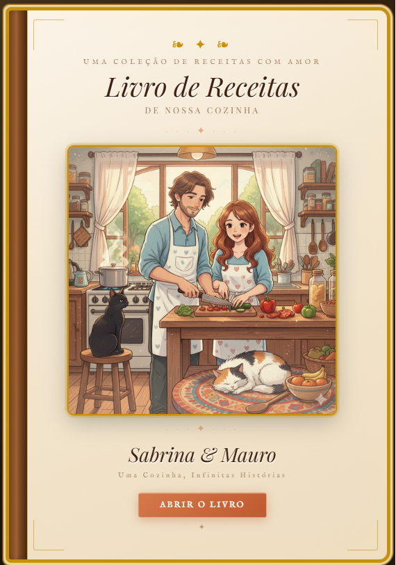

# 📖 Livro de Receitas Digital

> Personal recipe book web application with cloud database, real-time sync, and animated book-opening experience.

🔗 **[Live Demo](https://magenta-ganache-99298c.netlify.app)** · Built with HTML · CSS · JavaScript · Supabase

---

## 📸 Preview



---

## 🧩 About the Project

A fully functional digital recipe book built as a personal project during my career transition into software development and data/AI engineering.

The project simulates a real product: a private, personalized space for a couple to store and organize recipes, with cloud persistence, user authentication via shared password, and a polished UI inspired by physical book aesthetics.

It was conceived, designed, and directed by me — developed iteratively using AI-assisted workflows (Claude, ChatGPT), which reflects how modern product builders operate.

---

## ✨ Features

- 📖 **Animated book-opening** — CSS 3D page-turn animation on entry
- 🗂️ **Three recipe categories** — Vegan, Traditional, Desserts
- ☁️ **Cloud database** — Supabase (PostgreSQL) with real-time persistence
- 🔐 **Access control** — password-protected write access; public read
- 📝 **Full CRUD** — add and delete recipes via modal form
- 🎵 **Ambient music** — YouTube IFrame API with floating play/pause control
- 📱 **Responsive design** — mobile and desktop compatible
- 🍜 **Smart ingredient parsing** — auto-detects quantities and units
- 🔔 **Toast notifications** — user feedback on all actions
- 📄 **Auto-pagination** — page navigation with indicators per category

---

## 🛠️ Tech Stack

| Layer | Technology |
|-------|-----------|
| Frontend | HTML5, CSS3, Vanilla JavaScript |
| Database | Supabase (PostgreSQL via REST API) |
| Storage | Supabase Storage |
| Auth | Password-based access control |
| Hosting | Netlify (manual deploy) |
| Music | YouTube IFrame API |
| Fonts | Google Fonts (Playfair Display, Cormorant Garamond) |

---

## 🏗️ Architecture

```
## 🏗️ Architecture

Single-file application (`index.html`) organized in three layers:

- **CSS** — design tokens, animations, responsive layout
- **HTML** — book cover, tab system, modal, toast, music player  
- **JavaScript** — Supabase REST API, auth layer, UI state, ingredient parser, book animation

**Database schema (Supabase):**

```sql
create table receitas (
  id           uuid primary key default gen_random_uuid(),
  nome         text not null,
  categoria    text not null,  -- 'veganas' | 'tradicionais' | 'sobremesas'
  ingredientes text not null,
  modo_preparo text not null,
  criada_em    timestamp default now()

);
```

---

## 🚀 Getting Started

This is a single-file application — no build step or package manager required.

**Option 1 — Run locally:**
```bash
# Clone the repository
git clone https://github.com/YOUR_USERNAME/livro-receitas-digital.git

# Open in browser
open index.html
```

> ⚠️ Supabase requests require an active internet connection. The app will not load recipes offline.

**Option 2 — Deploy your own:**
1. Create a free [Supabase](https://supabase.com) project
2. Run the SQL schema above in the SQL Editor
3. Replace `SUPA_URL` and `SUPA_KEY` in the script section
4. Deploy to [Netlify](https://netlify.com) via drag-and-drop

---

## 💡 Technical Decisions

**Why a single HTML file?**
Chosen intentionally for this project stage — zero build complexity, instant deploy, fully portable. For a multi-user scalable version, the architecture would migrate to React + Supabase Auth.

**Why Supabase over localStorage?**
Cross-device sync was a requirement — the app needed to work identically on any device for both users without an account system.

**Why vanilla JavaScript?**
To demonstrate understanding of core DOM manipulation, event handling, async/await, and REST API integration without framework abstractions.

**AI-assisted development:**
This project was built using Claude and ChatGPT as development tools — directing architecture decisions, debugging, and feature implementation. This reflects a deliberate workflow I am developing: using AI to accelerate delivery while maintaining full understanding of the output.

---

## 📚 What I Learned

- Integrating a REST API (Supabase) without a backend layer
- Structuring a single-page application without a framework
- CSS animations and 3D transforms for UI storytelling
- Managing UI state (auth, tabs, pagination, modals) in vanilla JS
- Embedding third-party APIs (YouTube IFrame) with browser gesture constraints
- Deploying static files to production via Netlify

---


## 👤 Author

**Mauro Soprana**
Career transition from hospitality & sales leadership into Python, Data Engineering, and AI/ML.

[](https://linkedin.com/in/msoprana-python-ai)
[](https://github.com/maurosopranadev)
[](mailto:soprana.dev@gmail.com)

---

## 📄 License

This project is open for portfolio viewing. Please do not redistribute or use commercially without permission.
